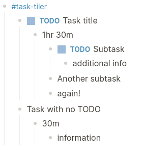

# Task Tiler Logseq Plugin

## Overview

This plugin serves as a bridge between Logseq and the [Task Tiler Client](../task-tiler-slint/). It converts tasks into a structured format and sends them to an MQTT broker, making them accessible to the client.

## Usage
The format of a collection of topics/tasks in logseq should be as follows:

Once installed and configured, simply use the /tiler command anywhere within the #tile-tasker tree to send the tasks to the MQTT broker.

## Installation and Configuration

- [ ]   Installation/Configuration guide
- [ ]   Steps to configure the MQTT broker connection.

## Functionality

- [x]   Send tasks to server
- [ ]   Receive tasks from server and update blocks

## Developing
The plugin requires the spago@next and purescript npm packages.
Install dependencies with `npm install`.

Minified production build can be built with `npm run build:dist`.

Development build can be built with `npm run build`

During development use `npm run watch` to have webpack watch for changes and automatically build to dist whenever `spago build` is run.
