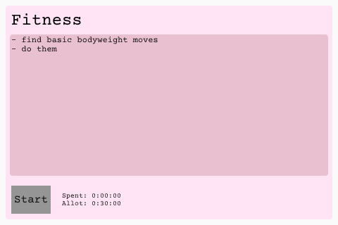

# Task Tiler Client

## Overview

The Task Tiler Client, currently available as a desktop and web application, enables users to visually manage the tasks sent from Logseq via the [Task Tiler Plugin](../task-tiler-logseq). It displays tasks as tiles, sized in relation to how much time has been allotted for them, making it easy to view and manage them.

## Functionality

- [x]   Retrieve tasks via [Task Tiler Server](../task-tiler-server/) and display them in tiles
- [x]   View more info about tasks
- [x]   Track time spent on tasks
- [ ]   Edit tasks
- [ ]   Send updated tasks back to broker
- [ ]   ESP32 client
- [ ]   Configure server address
- [x]   Web client

## Installation and Setup

- [ ]   Installation guide
- [ ]   Instructions for linking with Logseq

## Developing and building from source
The vscode [settings.json](.vscode/settings.json) can be modified to have rust-analyzer use the desktop or web feature-set for accurate cargo check/clippy suggestions within the editor.

#### Desktop
To run the desktop client use `cargo run --features desktop`

#### Web
To build a wasm package and launch a server use `cargo run --target wasm32-unknown-unknown --features web --release`
I use the `--release` flag because the debug build runs very slowly. 

The runner in use is [wasm-server-runner](https://github.com/jakobhellermann/wasm-server-runner), with some environment variables specified in the [config.toml](.cargo/config.toml) specifying the [index.html](./index.html) (based on wasm-server-runner default with a canvas element for slint to access) and the address.